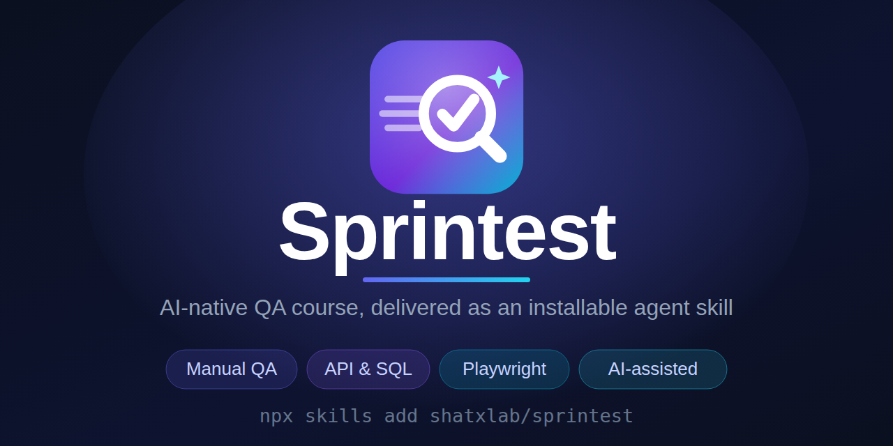

<p align="center">
  
</p>

# Sprintest

[English](#english) · [Русский](#русский)

---

## English

A free, AI-native QA course delivered as an **installable agent skill**. The
whole course — 23 modules from core manual QA to Playwright automation — lives
in this repository, and your AI agent can teach it.

### Install

In any agent with a terminal (Claude Code, Cursor, Codex, …):

```bash
npx skills add shatxlab/sprintest
```

Then open a new chat and say: **"Teach me QA — use the Sprintest skill."**

For chat-only clients (ChatGPT/Claude projects): download the repository as a
ZIP, unpack it, and attach the folder (or at minimum `SKILL.md` +
`content/course/`) to your project — then start the same way.

### What the skill contains

- `SKILL.md` — the tutor contract: file map, language rule, non-negotiables
- `content/course/manifest.json` — the module catalog (all 23 modules)
- `content/course/agent-guide.{en,ru}.md` — full teaching instructions for the agent
- `content/course/modules/<slug>/` — lesson content (EN/RU) + practice tasks with
  tutor instructions (review criteria, hint progressions, planted defects for
  simulated systems — the agent uses them to guide and review, and is instructed
  never to reveal them before the learner commits their own work)
- `content/course/glossary/`, `pillars.json`, `tracks/qa.json`

The course is bilingual (English + Russian) and follows the learner's language.
It ends with a final interview; the completion artifact is issued only after a
pass.

License: MIT — use it freely.

---

## Русский

Бесплатный AI-native курс QA, поставляемый как **устанавливаемый навык (skill)**
для агента. Весь курс — 23 модуля от основ manual QA до автоматизации на
Playwright — живёт в этом репозитории, и ваш AI-агент может его преподавать.

### Установка

В любом агенте с терминалом (Claude Code, Cursor, Codex, …):

```bash
npx skills add shatxlab/sprintest
```

Затем откройте новый чат и скажите: **«Научи меня QA — используй навык Sprintest.»**

Для клиентов без терминала (проекты ChatGPT/Claude): скачайте репозиторий как
ZIP, распакуйте и прикрепите папку (или как минимум `SKILL.md` +
`content/course/`) к проекту — и начните так же.

### Что содержит навык

- `SKILL.md` — контракт тьютора: карта файлов, правило языка, непреложные правила
- `content/course/manifest.json` — каталог модулей (все 23 модуля)
- `content/course/agent-guide.{en,ru}.md` — полные инструкции по преподаванию для агента
- `content/course/modules/<slug>/` — содержание уроков (EN/RU) + практические
  задания с инструкциями для тьютора (критерии ревью, прогрессия подсказок,
  заложенные дефекты для симулируемых систем — агент использует их, чтобы вести
  и проверять, и ему запрещено раскрывать их до того, как ученик сдаст
  собственную работу)
- `content/course/glossary/`, `pillars.json`, `tracks/qa.json`

Курс двуязычный (английский + русский) и следует за языком ученика. Он
заканчивается финальным интервью; артефакт о завершении выдаётся только после
успешного прохождения.

Лицензия: MIT — пользуйтесь свободно.
